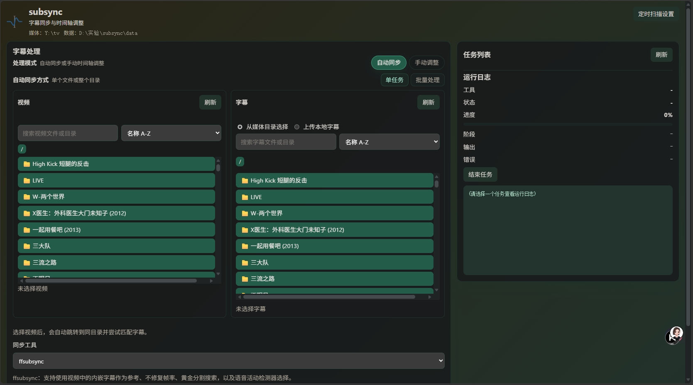
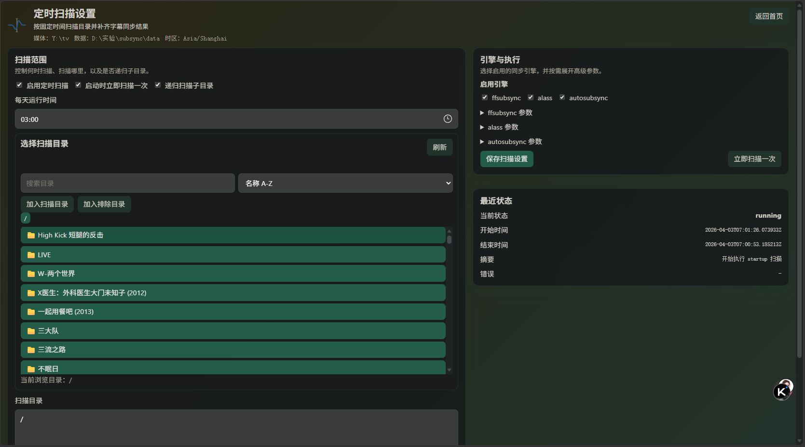

# subsync

一个用于本地媒体库的字幕同步 Web 工具。

`subsync` 将 `ffsubsync`、`alass`、`autosubsync` 统一到一个浏览器界面中，适合处理单个字幕同步、批量处理和自动扫描任务。

GitHub：

https://github.com/BlueBlueKitty/subsync

<p align="center">
  
</p>

<p align="center">
  
</p>

## 核心功能

- 支持 `ffsubsync`、`alass`、`autosubsync`
- 支持单任务同步、批量处理、自动扫描
- 支持上传字幕或直接从媒体目录选择文件
- 支持在浏览器中查看任务状态、日志和结果
- 支持字幕手动时间偏移调整

## 快速开始

### docker run

```bash
docker run -d \
  --name subsync \
  -p 1314:1314 \
  -e TZ=Asia/Shanghai \
  -e APP_PASSWORD=test \
  -e SECRET_KEY=change-this-secret \
  -e PORT=1314 \
  -e MEDIA_ROOT=/media \
  -e DATA_ROOT=/data \
  -e MAX_CONCURRENT_TASKS=1 \
  -v /path/to/media:/media \
  -v /path/to/data:/data \
  your-image:latest
```

访问：

```text
http://127.0.0.1:1314/
```

### docker compose

```yaml
services:
  subsync:
    image: your-image:latest
    container_name: subsync
    ports:
      - "1314:1314"
    environment:
      TZ: Asia/Shanghai
      APP_PASSWORD: test
      SECRET_KEY: change-this-secret
      PORT: "1314"
      MEDIA_ROOT: /media
      DATA_ROOT: /data
      MAX_CONCURRENT_TASKS: "1"
    volumes:
      - /path/to/media:/media
      - /path/to/data:/data
    restart: unless-stopped
```

启动：

```bash
docker compose up -d
```

环境变量说明：

- `APP_PASSWORD`
  Web 登录密码
- `SECRET_KEY`
  会话签名密钥，建议使用随机长字符串
- `MEDIA_ROOT`
  媒体目录挂载路径
- `DATA_ROOT`
  配置、上传文件、运行数据和临时文件目录
- `MAX_CONCURRENT_TASKS`
  后台任务最大并发数
- `TZ`
  容器时区，影响定时扫描时间
- `PORT`
  服务监听端口

## 构建镜像

构建本地镜像：

```bash
docker build \
  --build-arg APP_VERSION=0.1.0 \
  -t subsync:v0.1.0 \
  -t subsync:latest \
  .
```

如需推送到自己的仓库，可自行替换镜像名。

## 本地运行

安装依赖：

```bash
python -m venv .venv
. .venv/bin/activate
pip install -r requirements.txt
```

准备环境变量：

```bash
export APP_PASSWORD=test
export SECRET_KEY=change-this-secret
export TZ=Asia/Shanghai
export MEDIA_ROOT=/path/to/media
export DATA_ROOT=/path/to/data
export PORT=1314
export MAX_CONCURRENT_TASKS=1
```

启动：

```bash
uvicorn app.main:app --host 0.0.0.0 --port 1314
```

Windows PowerShell 示例：

```powershell
$env:APP_PASSWORD="test"
$env:SECRET_KEY="change-this-secret"
$env:TZ="Asia/Shanghai"
$env:MEDIA_ROOT="D:\media"
$env:DATA_ROOT="D:\subsync-data"
$env:PORT="1314"
$env:MAX_CONCURRENT_TASKS="1"
.\.venv\Scripts\python -m uvicorn app.main:app --host 0.0.0.0 --port 1314
```

## 参考项目

- `ffsubsync`
  https://github.com/smacke/ffsubsync
- `alass`
  https://github.com/kaegi/alass
- `AutoSubSync`
  https://github.com/denizsafak/AutoSubSync
